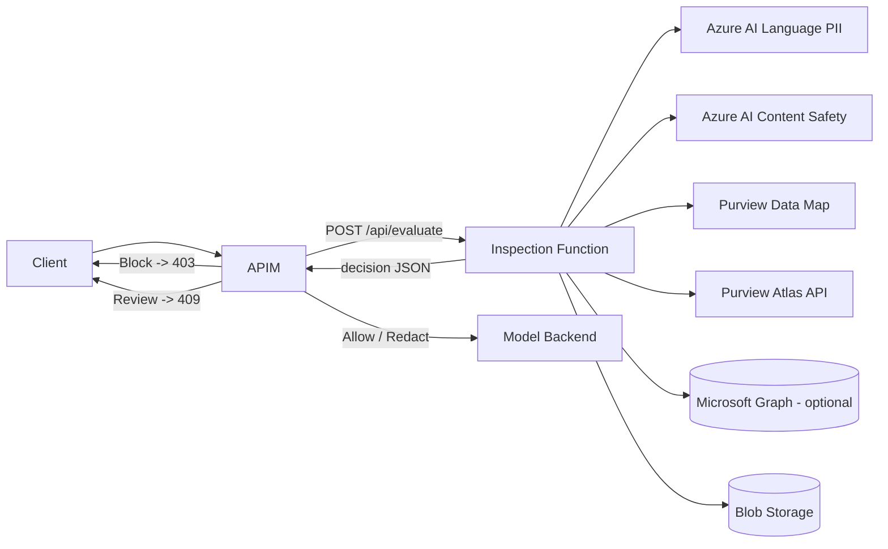

WARNING: ANY USE BY YOU OF THE CODE PROVIDED IN THIS EXAMPLE IS AT YOUR OWN RISK.

Microsoft provides this sample code "as is" without warranty of any kind, either express or implied, including but not limited to the implied warranties of merchantability and/or fitness for a particular purpose.

# APIM Inspection / DLP Decision Service

A solution for **Azure API Management (APIM)** that inspects requests **before**
they are forwarded to a model backend (Azure AI Foundry, Azure OpenAI, or
another LLM). APIM calls a Python **Azure Function** synchronously; the Function
performs PII detection, content safety, sensitivity-label lookup, Microsoft
Purview Data Map lookup, and Purview Atlas lookup, then returns a normalized
decision:

> **Allow · Warn · Redact · Block · Review**

The Function **never calls the model backend** and **never stores sensitive
content** unless explicitly configured.

## Architecture



- **APIM** is the policy enforcement point.
- **The Function** is the inspection and decision service.
- APIM translates the returned `action` into an HTTP outcome and forwards
  allowed (or redacted) requests to the backend.

## Components

| Path | Purpose |
| --- | --- |
| [function/function_app.py](function/function_app.py) | HTTP-triggered Azure Function (Python v2 model): `POST /api/evaluate` inspection orchestrator. |
| [function/src/](function/src) | Config, models, service clients, document handling, policy engine, security, and utilities. |
| [function/tests/](function/tests) | Unit tests for the decision engine, chunking, label mapping, and models. |
| [function/README.md](function/README.md) | Full service documentation: settings, Managed Identity permissions, deployment, and extension points. |
| [apim/inspection.policy.xml](apim/inspection.policy.xml) | APIM policy: calls the Function, enforces the decision, logs correlation ID + action. |
| [function/requirements.txt](function/requirements.txt) | Python dependencies. |
| [function/local.settings.json.sample](function/local.settings.json.sample) | Sample app settings for local runs. |

## Decision contract

`POST /api/evaluate` returns:

```json
{
  "correlationId": "string",
  "action": "Block",
  "classification": "HighlyConfidential",
  "riskScore": 95,
  "policyVersion": "2026-07-01",
  "reasonCodes": ["PII_BLOCK_SSN", "LABEL_HIGHLY_CONFIDENTIAL"],
  "findings": {
    "pii": [{ "category": "USSocialSecurityNumber", "family": "ssn", "confidence": 0.98, "source": "AzureAILanguage" }],
    "contentSafety": [],
    "purview": { "classifications": ["Regulated"], "labels": ["Highly Confidential"] },
    "atlas": { "classifications": ["FinancialData"], "lineageAvailable": true }
  },
  "redactedText": null,
  "audit": { "inspected": true, "inspectionMode": "synchronous", "contentStored": false, "latencyMs": 123 }
}
```

See [function/README.md](function/README.md) for the full request/response schema
and the default policy table.

## Run locally

Prerequisites: [Azure Functions Core Tools v4](https://learn.microsoft.com/azure/azure-functions/functions-run-local)
and Python 3.11+.

```powershell
cd function
python -m venv .venv
.\.venv\Scripts\Activate.ps1
pip install -r requirements.txt
copy local.settings.json.sample local.settings.json   # fill in your endpoints

func start        # exposes http://localhost:7071/api/evaluate
pytest -q         # run the unit tests
```

Sample request:

```powershell
curl -X POST "http://localhost:7071/api/evaluate?code=<function-key>" `
  -H "Content-Type: application/json" `
  -d '{
    "correlationId": "11111111-1111-1111-1111-111111111111",
    "user": { "id": "u1", "groups": ["finance"] },
    "source": { "application": "chat-ui", "model": "gpt-4o", "requestPath": "/chat/completions" },
    "content": { "type": "prompt", "text": "My SSN is 123-45-6789", "metadata": { "x-data-classification": "Confidential" } },
    "options": { "returnRedactedText": true, "runPiiDetection": true, "runContentSafety": true }
  }'
```

## Deploy to Azure

1. Create a Function App (Linux, Python 3.11, Functions v4) with a
   **system-assigned Managed Identity**.
2. Grant the identity: `Cognitive Services User` (Language + Content Safety),
   Purview `Data Reader`, `Storage Blob Data Reader`, and optionally the Graph
   `InformationProtectionPolicy.Read` application permission.
3. Configure app settings (see [function/README.md](function/README.md) and
   [function/local.settings.json.sample](function/local.settings.json.sample)).
4. Publish:

   ```powershell
   cd function
   func azure functionapp publish <your-inspection-function-app>
   ```

## Configure APIM

1. Add these **Named values** in APIM:
   - `inspection-function-url` → `https://<app>.azurewebsites.net/api/evaluate`
   - `inspection-function-key` → the function key (store as a Key Vault secret).
   - *(optional, for the deterministic pre-check)* `enable-precheck`
     (`true`/`false`), `blocked-classifications`
     (e.g. `HighlyConfidential,Regulated`), and `precheck-block-regex`
     (e.g. a US SSN pattern). These have safe inline fallbacks if omitted.
2. Apply [apim/inspection.policy.xml](apim/inspection.policy.xml) to the API (or
   operation) policy. It runs a cheap **deterministic pre-check** (blocked
   classification headers + a regex body scan) *before* any downstream call,
   then invokes the Function and enforces its decision (403 on Block, 409 on
   Review, prompt replacement on Redact), logging the correlation ID and action.

## Security

- **Managed Identity** for all Azure calls; no keys in code.
- Prefer **private endpoints** for Language, Content Safety, Purview, and Storage.
- Raw prompt/document content is **not logged** unless `LOG_RAW_CONTENT=true`.
- Internal exceptions are never returned to APIM — clients receive a safe,
  minimal decision governed by `FAIL_MODE` / `DEFAULT_ACTION_ON_ERROR`.
- Use `fail_closed` for regulated workloads so inspection failures never
  silently allow sensitive data through.
