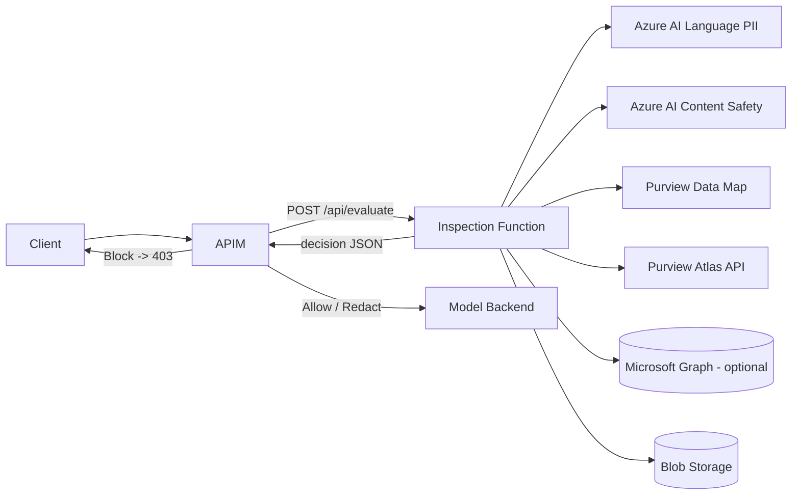

WARNING: ANY USE BY YOU OF THE CODE PROVIDED IN THIS EXAMPLE IS AT YOUR OWN RISK.

Microsoft provides this sample code "as is" without warranty of any kind, either express or implied, including but not limited to the implied warranties of merchantability and/or fitness for a particular purpose.

# APIM Inspection / DLP Decision Service

A Python **Azure Function** (hosted in Azure App Service) that
Azure API Management (APIM) calls **synchronously** before forwarding a request
to Azure AI Foundry, Azure OpenAI, or another model backend.

The service inspects prompt text, request metadata, uploaded document
references, and optional Microsoft Purview asset identifiers, then returns a
normalized DLP / security decision:

> **Allow · Warn · Redact · Block · Review**

The service **never calls the model backend** and **never stores sensitive
content** unless explicitly configured.

---

## Architecture



- **APIM** is the policy enforcement point.
- **This Function** is the inspection and decision service.
- The Function performs PII detection, content safety, Purview label lookup,
  Purview Data Map lookup, and Atlas API lookup, then returns a decision.

---

## Project structure

```
inspection/
├─ function_app.py                     # HTTP trigger: POST /api/evaluate (orchestrator)
├─ host.json
├─ requirements.txt
├─ local.settings.json.sample
├─ conftest.py                         # test import path
├─ README.md
├─ src/
│  ├─ config.py                        # env-driven settings, PII family mapping, thresholds
│  ├─ models.py                        # pydantic request/response contract
│  ├─ clients/
│  │  ├─ azure_language_client.py      # Azure AI Language PII detection (+ chunking, redaction)
│  │  ├─ content_safety_client.py      # Azure AI Content Safety
│  │  ├─ purview_datamap_client.py     # Purview Data Map lookup
│  │  ├─ atlas_client.py               # Apache Atlas v2 API (Purview)
│  │  └─ graph_label_client.py         # Optional Microsoft Graph sensitivity labels
│  ├─ document/
│  │  ├─ document_extractor.py         # text/plain, JSON, CSV, DOCX, PDF extraction
│  │  └─ blob_loader.py                # Managed Identity blob download + size limits
│  ├─ policy/
│  │  ├─ decision_engine.py            # deterministic Allow/Warn/Redact/Block/Review
│  │  ├─ risk_scoring.py               # bounded 0-100 risk score
│  │  └─ label_mapping.py              # sensitivity-label normalization
│  ├─ security/
│  │  └─ auth.py                       # DefaultAzureCredential + token caching
│  └─ utils/
│     ├─ logging.py                    # structured JSON logging for App Insights
│     ├─ chunking.py                   # overlapping text windows
│     └─ http.py                       # timeout + retry with exponential backoff
└─ tests/
   ├─ test_decision_engine.py
   ├─ test_text_chunking.py
   ├─ test_label_mapping.py
   └─ test_models.py
```

---

## API contract

### `POST /api/evaluate`

Request:

```json
{
  "correlationId": "string",
  "requestId": "string",
  "user": { "id": "string", "upn": "string", "groups": ["string"], "claims": {} },
  "source": {
    "application": "string",
    "apimSubscriptionId": "string",
    "operation": "string",
    "requestPath": "string",
    "model": "string"
  },
  "content": {
    "type": "prompt",
    "text": "string",
    "blobUrl": "string",
    "fileName": "string",
    "contentType": "string",
    "metadata": {
      "x-data-classification": "Confidential",
      "x-purview-label-id": "string",
      "qualifiedName": "string",
      "purviewGuid": "string"
    }
  },
  "options": {
    "returnRedactedText": true,
    "lookupPurview": true,
    "lookupAtlas": true,
    "runContentSafety": true,
    "runPiiDetection": true
  }
}
```

Response:

```json
{
  "correlationId": "string",
  "action": "Block",
  "classification": "HighlyConfidential",
  "riskScore": 95,
  "policyVersion": "2026-07-01",
  "reasonCodes": ["PII_BLOCK_SSN", "LABEL_HIGHLY_CONFIDENTIAL"],
  "findings": {
    "pii": [{ "category": "USSocialSecurityNumber", "family": "ssn", "confidence": 0.98, "source": "AzureAILanguage" }],
    "contentSafety": [],
    "purview": { "classifications": ["Regulated"], "labels": ["Highly Confidential"], "assetGuid": "string", "qualifiedName": "string" },
    "atlas": { "classifications": ["FinancialData"], "lineageAvailable": true }
  },
  "redactedText": null,
  "audit": { "inspected": true, "inspectionMode": "synchronous", "contentStored": false, "latencyMs": 123 }
}
```

> The Function always returns **HTTP 200** with an actionable decision object.
> APIM is responsible for translating `action` into an HTTP outcome (e.g. 403 on
> `Block`). This keeps the contract simple and avoids ambiguous error handling.

---

## Default policy

| Condition | Action |
| --- | --- |
| SSN, credit card, bank account, passport, tax ID, or driver license above threshold | **Block** |
| Email, phone, address, or person name above threshold, `returnRedactedText=true` | **Redact** |
| Email/phone/address/person detected but redaction not requested | **Warn** |
| Label normalizes to `HighlyConfidential` or `Regulated` | **Block** |
| Content safety severity ≥ `CONTENT_SAFETY_SEVERITY_THRESHOLD` | **Block** |
| Purview / Atlas classification contains FinancialData, CustomerData, PHI, PCI, or Restricted | **Review** |
| Inspection incomplete (unsupported format, parse failure) | **Review** |
| File larger than `MAX_FILE_BYTES` | **Block** (fail_closed) / **Review** (otherwise) |
| Inspection dependency failure | Per `FAIL_MODE` (fail_closed→Block, review→Review, fail_open→Allow) |
| No sensitive findings and label Public/Internal/Unknown | **Allow** |

When multiple rules match, the **most restrictive** action wins
(`Block` > `Review` > `Redact` > `Warn` > `Allow`).

---

## Configuration (App Settings)

| Setting | Default | Purpose |
| --- | --- | --- |
| `AZURE_LANGUAGE_ENDPOINT` | — | Azure AI Language resource endpoint |
| `AZURE_LANGUAGE_API_VERSION` | `2023-04-01` | Language API version |
| `CONTENT_SAFETY_ENDPOINT` | — | Azure AI Content Safety endpoint |
| `CONTENT_SAFETY_API_VERSION` | `2024-09-01` | Content Safety API version |
| `PURVIEW_ACCOUNT_ENDPOINT` | — | Purview account endpoint |
| `GRAPH_ENDPOINT` | `https://graph.microsoft.com` | Microsoft Graph base |
| `STORAGE_ACCOUNT_URL` | — | Blob endpoint for relative blob paths |
| `POLICY_VERSION` | `2026-07-01` | Stamped into responses |
| `FAIL_MODE` | `fail_closed` | `fail_open` / `fail_closed` / `review` |
| `DEFAULT_ACTION_ON_ERROR` | `Review` | Action on unhandled/parse errors |
| `MAX_PROMPT_CHARS` | `50000` | Max inspected text; longer input is truncated and flagged incomplete (→ Review) |
| `MAX_CHUNK_CHARS` | `5000` | Chunk window size |
| `CHUNK_OVERLAP_CHARS` | `200` | Overlap between chunks |
| `MAX_FILE_BYTES` | `20971520` | Max blob size to inspect |
| `MAX_DECOMPRESSED_BYTES` | `104857600` | Max decompressed size for archive docs (DOCX) — zip-bomb guard |
| `ALLOWED_BLOB_HOSTS` | *(empty)* | Comma-separated exact blob hosts allowed for download (SSRF allowlist). Empty → STORAGE_ACCOUNT_URL host, then trusted Azure blob suffixes |
| `ENABLE_GRAPH_LABEL_LOOKUP` | `false` | Optional Graph label lookup |
| `ENABLE_PURVIEW_LOOKUP` | `true` | Purview Data Map lookup |
| `ENABLE_ATLAS_LOOKUP` | `true` | Atlas API lookup |
| `ENABLE_CONTENT_SAFETY` | `true` | Content safety inspection |
| `ENABLE_PII_DETECTION` | `true` | PII inspection |
| `LOG_RAW_CONTENT` | `false` | **Keep false in production** |
| `CONTENT_SAFETY_SEVERITY_THRESHOLD` | `4` | Severity (0-7) that triggers Block |
| `HTTP_TIMEOUT_SECONDS` | `10` | Per-request timeout |
| `HTTP_MAX_RETRIES` | `3` | Retry attempts on transient errors |
| `HTTP_BACKOFF_BASE_SECONDS` | `0.5` | Backoff base |
| `PII_THRESHOLD_<FAMILY>` | see sample | Per-family confidence overrides |

Copy `local.settings.json.sample` to `local.settings.json` for local runs.

---

## Deployment prerequisites

- Python **3.11+**, [Azure Functions Core Tools v4](https://learn.microsoft.com/azure/azure-functions/functions-run-local).
- A Function App (Linux, Python 3.11, Functions v4) with **system-assigned
  Managed Identity** enabled.
- Azure AI Language, Azure AI Content Safety, Purview account, and (optionally)
  a Storage account and Microsoft Graph app permission.

### Managed Identity permissions

Grant the Function App's Managed Identity:

| Target | Role / permission |
| --- | --- |
| Azure AI Language | `Cognitive Services User` |
| Azure AI Content Safety | `Cognitive Services User` |
| Microsoft Purview | `Data Reader` (or a collection-scoped reader role) |
| Storage account (for blob inspection) | `Storage Blob Data Reader` |
| Microsoft Graph (optional) | `InformationProtectionPolicy.Read` (application) |

### Deploy

```powershell
cd inspection
python -m venv .venv
.\.venv\Scripts\Activate.ps1
pip install -r requirements.txt

func azure functionapp publish <your-inspection-function-app>
```

---

## Run and test locally

```powershell
cd inspection
pip install -r requirements.txt pytest
copy local.settings.json.sample local.settings.json
func start          # exposes http://localhost:7071/api/evaluate
pytest -q           # run unit tests
```

### Sample curl

```bash
curl -X POST "http://localhost:7071/api/evaluate?code=<function-key>" \
  -H "Content-Type: application/json" \
  -d '{
    "correlationId": "11111111-1111-1111-1111-111111111111",
    "user": { "id": "u1", "groups": ["finance"] },
    "source": { "application": "chat-ui", "model": "gpt-4o", "requestPath": "/chat/completions" },
    "content": { "type": "prompt", "text": "My SSN is 123-45-6789", "metadata": { "x-data-classification": "Confidential" } },
    "options": { "returnRedactedText": true, "runPiiDetection": true, "runContentSafety": true }
  }'
```

---

## APIM integration

APIM calls the Function via a `send-request`, parses `action`, and enforces the
outcome before forwarding to the model backend.

```xml
<policies>
  <inbound>
    <base />
    <!-- Build the inspection request from the incoming call. -->
    <set-variable name="correlationId" value="@(context.RequestId.ToString())" />
    <send-request mode="new" response-variable-name="inspection" timeout="20" ignore-error="true">
      <set-url>{{inspection-function-url}}</set-url>
      <set-method>POST</set-method>
      <set-header name="x-functions-key" exists-action="override">
        <value>{{inspection-function-key}}</value>
      </set-header>
      <set-header name="Content-Type" exists-action="override">
        <value>application/json</value>
      </set-header>
      <set-body>@{
        return new JObject(
          new JProperty("correlationId", context.Variables.GetValueOrDefault<string>("correlationId")),
          new JProperty("user", new JObject(
            new JProperty("id", context.User?.Id ?? ""),
            new JProperty("groups", new JArray(context.User?.Groups?.Select(g => g.Name) ?? new string[0])))),
          new JProperty("source", new JObject(
            new JProperty("application", context.Subscription?.Name ?? ""),
            new JProperty("apimSubscriptionId", context.Subscription?.Id ?? ""),
            new JProperty("operation", context.Operation?.Name ?? ""),
            new JProperty("requestPath", context.Request.Url.Path),
            new JProperty("model", context.Request.Headers.GetValueOrDefault("x-model", "")))),
          new JProperty("content", new JObject(
            new JProperty("type", "prompt"),
            new JProperty("text", context.Request.Body.As<string>(preserveContent: true)),
            new JProperty("metadata", new JObject(
              new JProperty("x-data-classification", context.Request.Headers.GetValueOrDefault("x-data-classification", "")),
              new JProperty("x-purview-label-id", context.Request.Headers.GetValueOrDefault("x-purview-label-id", "")))))),
          new JProperty("options", new JObject(
            new JProperty("returnRedactedText", true),
            new JProperty("runPiiDetection", true),
            new JProperty("runContentSafety", true),
            new JProperty("lookupPurview", true),
            new JProperty("lookupAtlas", true)))
        ).ToString();
      }</set-body>
    </send-request>

    <!-- Parse the decision. -->
    <set-variable name="decision" value="@(((IResponse)context.Variables["inspection"]).Body.As<JObject>(preserveContent: true))" />
    <set-variable name="action" value="@(((JObject)context.Variables["decision"])["action"].ToString())" />

    <!-- Log correlation id + action (App Insights). -->
    <trace source="inspection" severity="information">
      <message>@($"correlationId={((JObject)context.Variables["decision"])["correlationId"]} action={context.Variables.GetValueOrDefault<string>("action")}")</message>
    </trace>

    <choose>
      <!-- Block -> 403. -->
      <when condition="@(context.Variables.GetValueOrDefault<string>("action") == "Block")">
        <return-response>
          <set-status code="403" reason="Forbidden" />
          <set-header name="Content-Type" exists-action="override">
            <value>application/json</value>
          </set-header>
          <set-body>@{
            return new JObject(
              new JProperty("message", "Request blocked by data protection policy."),
              new JProperty("correlationId", ((JObject)context.Variables["decision"])["correlationId"]),
              new JProperty("reasonCodes", ((JObject)context.Variables["decision"])["reasonCodes"])
            ).ToString();
          }</set-body>
        </return-response>
      </when>
      <!-- Redact -> replace prompt with redactedText when present. -->
      <when condition="@(context.Variables.GetValueOrDefault<string>("action") == "Redact" && ((JObject)context.Variables["decision"])["redactedText"].Type != JTokenType.Null)">
        <set-body>@(((JObject)context.Variables["decision"])["redactedText"].ToString())</set-body>
      </when>
      <!-- Review -> optionally route to a human-review queue or reject. -->
      <when condition="@(context.Variables.GetValueOrDefault<string>("action") == "Review")">
        <return-response>
          <set-status code="409" reason="Requires Review" />
          <set-body>{"message":"Request requires manual review."}</set-body>
        </return-response>
      </when>
      <!-- Allow / Warn -> continue to backend. -->
    </choose>
  </inbound>
  <backend><base /></backend>
  <outbound><base /></outbound>
  <on-error><base /></on-error>
</policies>
```

Named values required in APIM:

- `inspection-function-url` → `https://<app>.azurewebsites.net/api/evaluate`
- `inspection-function-key` → the function key (store as a **secret** / Key Vault reference).

> For Event Hub logging, add a `log-to-eventhub` policy emitting the
> `correlationId` and `action` alongside the `trace`.

---

## Security considerations

- **Managed Identity** for all Azure calls (`DefaultAzureCredential`); no keys in code.
- Prefer **private endpoints** for Language, Content Safety, Purview, and Storage.
- **Raw prompt/document content is never logged** unless `LOG_RAW_CONTENT=true`
  (keep it `false` in production). Findings are logged as categories/counts only.
- The Function **does not persist** content; `audit.contentStored` is `false`.
- Internal exceptions are never returned to APIM — clients get a **safe,
  minimal decision** driven by `FAIL_MODE` / `DEFAULT_ACTION_ON_ERROR`.
- All thresholds and policy behavior are **configurable** via App Settings.
- Store the function key in **Key Vault** and reference it from APIM named values.
- Enforce `fail_closed` for regulated workloads so inspection failures never
  silently allow sensitive data through.

### Injection / malformed-data hardening

- **SSRF allowlist for `blobUrl`:** a caller-supplied blob URL must use HTTPS
  and target a permitted host (`ALLOWED_BLOB_HOSTS`, else the
  `STORAGE_ACCOUNT_URL` host, else a trusted Azure blob suffix). This prevents
  the Storage Managed-Identity token from being sent to an attacker host.
  Container/blob paths are checked for traversal (`..`).
- **Identifier injection:** user-supplied Purview/Atlas GUIDs are validated
  against a strict allowlist and percent-encoded before being placed in a URL
  path, blocking path traversal into other catalog API routes.
- **Decompression bombs:** DOCX (zip) uncompressed size is checked against
  `MAX_DECOMPRESSED_BYTES` before parsing; extracted text is capped at
  `MAX_PROMPT_CHARS`. Oversized inputs are marked incomplete (→ Review).
- **Redirect safety:** the shared HTTP client disables redirect following so a
  redirect cannot cause a bearer token to be replayed to another host.
- **Schema validation:** all input is validated with pydantic; unknown fields
  are ignored and malformed JSON returns a safe fail-mode decision.

---

## Operational logging guidance

- Logs are emitted as **single-line JSON** (see `src/utils/logging.py`) so
  Application Insights parses them into `customDimensions`.
- Every decision logs: `correlationId`, `action`, `classification`,
  `riskScore`, `reasonCodes`, PII/content-safety **counts**, `latencyMs`, and
  `dependencyFailure` — never raw content.
- Use `correlationId` to join APIM traces, Function logs, and backend telemetry.
- Suggested App Insights alerts: spike in `Block`/`Review` rate, elevated
  `dependencyFailure`, and `latencyMs` p95 regressions.

---

## Extending

- **New document formats:** register an extractor via
  `document_extractor.register_extractor(key, fn)`.
- **New label mappings:** set `LABEL_MAPPING_OVERRIDES` (JSON) or extend
  `_BASE_LABEL_MAP` in `label_mapping.py`.
- **New policy rules:** add rules in `decision_engine.py`; keep them
  deterministic and covered by tests.
